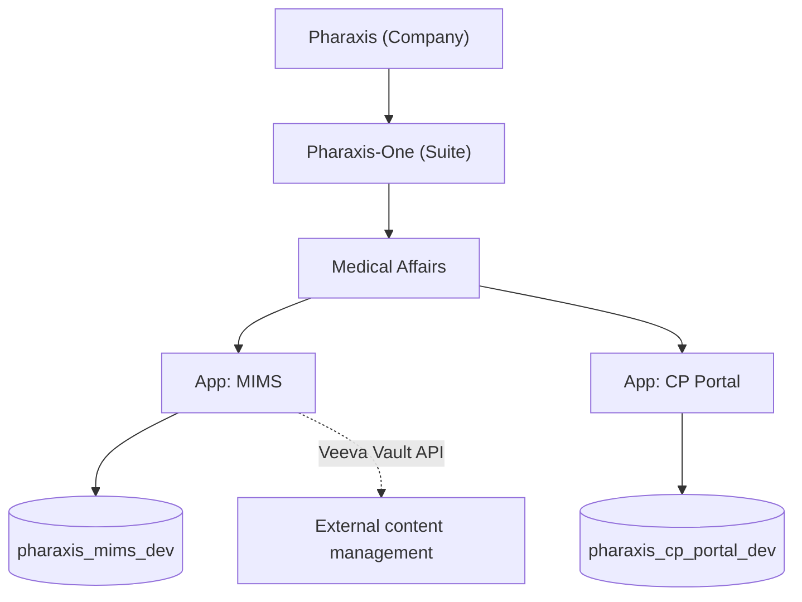
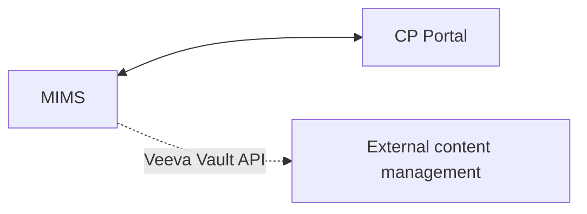

# Architecture Overview

## Enterprise Hierarchy

Pharaxis is the company.  
Pharaxis-One is the product suite under Pharaxis.

Within Pharaxis-One:
- 2 active applications: `MIMS`, `CP Portal`
- Each application has its own dedicated database

> **Changed 2026-09-09.** Vault, QMS, AI Agent and the Test Console were deleted
> on Rohith's instruction — see SOP §43–§45. Regulated content management is now
> met by integrating with **Veeva Vault and other external content management
> systems**, not by an in-house app.

## Integration Architecture

## App And Database Registry

| Application | Path | Database | Status |
|---|---|---|---|
| MIMS | `apps/mims` | `pharaxis_mims_dev` | Active |
| CP Portal | `apps/cp-portal` | `pharaxis_cp_portal_dev` | Active |

## Integration Rules (Locked)

- MIMS and CP Portal can integrate with each other.
- MIMS integrates with external content management systems (Veeva Vault and
  others) per organisation, through its integration config.

## Data And Platform Standards

- DB platform: MySQL 8+.
- DB isolation: one DB per application.
- Naming standard: `pharaxis_<app>_dev`.
- Environment contract: `MYSQL_*`.
- Runtime secrets: provided via `.env` and never committed.
